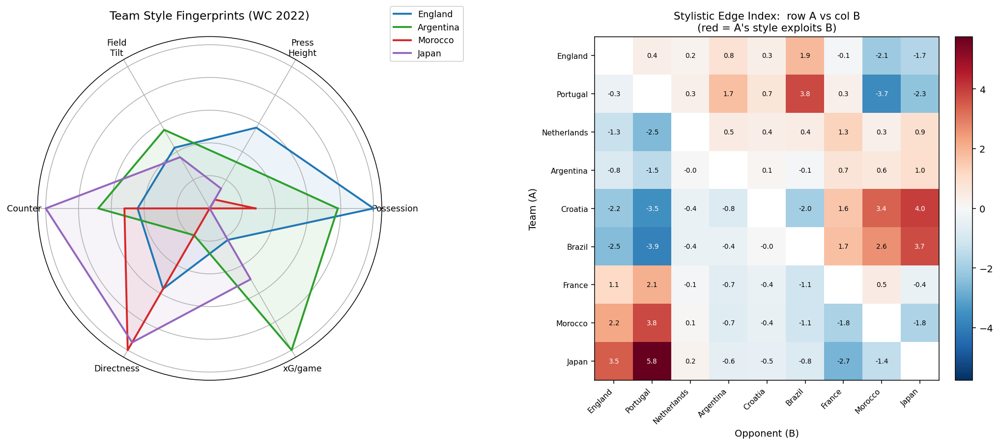

# Football Prediction Engine ⚽

A data-driven football toolkit with two parts: **(1)** a backtested model that
predicts match outcomes and simulates an entire World Cup, and **(2)** a
team-style and player analytics layer built from StatsBomb event data. Both
fetch their data automatically, so the repo runs anywhere with no manual setup.

---

## What's inside

**Part 1 — Match & tournament prediction** (universal: any national team, any time)
- Win / draw / loss probabilities, expected goals, most likely scorelines,
  over/under 2.5, both-teams-to-score, and clean-sheet probabilities for any fixture.
- A full World Cup Monte Carlo that fixes already-played results and simulates
  the rest, producing each team's title odds.

**Part 2 — Style & player analytics** (StatsBomb event data, WC 2022 demo)
- Team "style fingerprints" (possession, pressing, directness, counter threat, …).
- Per-90 player profiles (npxG, xA, progressive passes/carries, defensive actions).
- An interpretable stylistic-matchup (counter) index + radar/heatmap visualization.

---

## Results

**Backtest** — trained on data before 2024, evaluated on **2,542 unseen matches** after 2024:

| Metric | Model | Baseline |
|---|---|---|
| Log-loss | **0.884** | 1.054 |
| Brier | **0.519** | 0.636 |
| Accuracy (W/D/L) | **59.0%** | 49.1% |
| Total-goals MAE | 1.40 | — |

**Calibration is near-perfect** — matches rated 60–80% home win came in at 76%;
those rated 80%+ came in at 93%. The probabilities mean what they say.

**Example prediction** (`python predictor.py "France" "Spain"`):

```
France 28.1% | Draw 27.4% | Spain 44.5%
Expected goals  France 1.10 - 1.45 Spain
Total goals     most likely 3, 80% interval 1-5
Most likely     1-1 (13.0%), 0-1 (10.8%), 1-2 (9.0%)
Over 2.5 46.7%  |  BTTS 51.5%
```

**Team style fingerprints** (WC 2022, per-match averages):

| Team | Poss% | Directness | Press height | Counter% | xG/g |
|---|---|---|---|---|---|
| England | 63.3 | 20.8 | 62.5 | 3.3 | 1.7 |
| Argentina | 55.9 | 19.4 | 57.8 | 5.1 | 3.1 |
| Morocco | 38.9 | 22.4 | 52.7 | 3.9 | 1.3 |
| Japan | 29.4 | 22.2 | 54.2 | 7.5 | 2.2 |



---

## Quickstart

```bash
pip install -r requirements.txt

# Part 1 — prediction
python predictor.py "France" "Spain"   # single match
python run.py                          # World Cup title odds
python backtest.py                     # reproduce the accuracy numbers

# Part 2 — analytics (downloads StatsBomb data on first run)
python analytics.py                    # team style fingerprints
python players.py                      # per-90 player profiles
python matchup.py                      # style-clash matrix + chart
```

All data is downloaded automatically on first run; nothing to set up by hand.

---

## How it works

1. **Strength model** (`strength.py`): a weighted Poisson regression,
   `log(expected goals) = intercept + attack[scorer] − defence[conceder] +
   home_advantage`, solving every team at once, with time-decay (2-year
   half-life) and match-importance weighting.
2. **Dixon-Coles correction** (`predictor.py`): a rho parameter estimated by
   MLE corrects the independent-Poisson bias on 0-0 / 1-0 / 1-1 results,
   improving both accuracy and calibration.
3. **Scoreline matrix**: the outer product of two Poisson distributions ×
   the DC correction; every probability (W/D/L, over/under, BTTS, scorelines)
   is integrated from this single matrix.
4. **Tournament Monte Carlo** (`tournament.py`): fixes played results, simulates
   the rest under the 48-team format (12 groups → top 2 + 8 best thirds → knockout),
   repeated thousands of times for title odds.
5. **Style metrics** (`analytics.py`, `players.py`): derived from StatsBomb event
   data — possession, PPDA/press height, directness, field tilt, set-piece and
   counter shares, plus per-90 player output.
6. **Stylistic edge index** (`matchup.py`): standardized style factors combined
   with football logic (press × build-up, counter × transition risk). This is an
   *interpretable heuristic*, not a win probability — see Limitations.

---

## Project structure

```
.
├── strength.py          # weighted Poisson strength model
├── predictor.py         # single-match prediction engine (CLI)
├── backtest.py          # out-of-time accuracy backtest
├── tournament.py        # World Cup Monte Carlo
├── run.py               # title odds (with market comparison)
├── statsbomb_data.py    # auto-downloads StatsBomb event data
├── analytics.py         # team style fingerprints
├── players.py           # per-90 player profiles
├── matchup.py           # stylistic-matchup index + visualization
├── requirements.txt
└── README.md
```

---

## Data sources

- Match results: [martj42/international_results](https://github.com/martj42/international_results)
  — updated daily, includes in-progress fixtures; auto-downloaded.
- Event data: [StatsBomb Open Data](https://github.com/statsbomb/open-data)
  — free, public; auto-downloaded (no API key).

---

## Limitations (stated, not hidden)

- Football is high-variance, so ~59% W/D/L accuracy is a solid ceiling, not a flaw.
  Be skeptical of any model claiming much higher.
- The stylistic edge index is an **interpretable heuristic**, not a win
  probability. Reliable "counter" effects need far larger style-tagged samples
  than national teams provide.
- "Real-time" here means **daily, pre-match** (data refreshes from the latest
  results). True in-play data (lineups, injuries, live odds) needs a paid feed;
  the data layer is abstracted so a paid source can be swapped in.
- The prediction model is results-based (works for any team). The style/player
  analytics only cover teams with StatsBomb event data.

---

## Possible extensions

- Feed style interaction terms (press × build-up, counter × transition risk)
  into the match model as features, and use the backtest to confirm which are
  statistically significant.
- Adjust strength for missing players (injuries / suspensions).
- Wrap it in Streamlit / FastAPI as a live query service for any fixture.

---

## License

MIT
